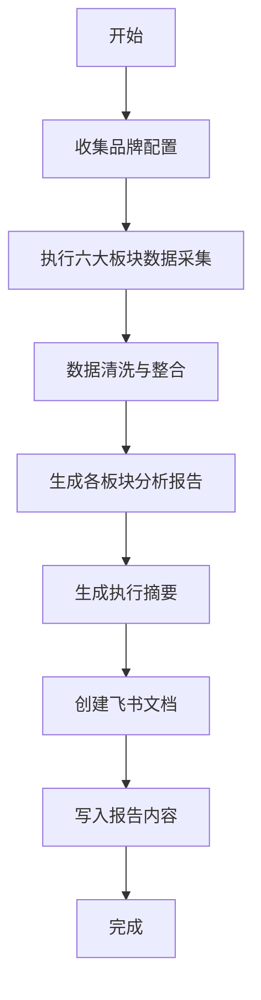

# 竞品监测 Skill v1.0

## 1. Skill 概述

本Skill用于执行竞品品牌的全维度监测，覆盖6大核心板块，输出结构化的月度监测报告至飞书文档。

### 1.1 监测维度

| 板块 | 监测内容 | 数据源/API |
|------|---------|-----------|
| **品牌新品动向** | 新品上线时间、主推卖点、近期主推产品 | 品牌官网、官方社媒账号 |
| **社媒数据** | Post数量、涨粉数、曝光量、发布频次、高互动内容 | Instagram/TikTok/YouTube/Facebook API |
| **红人合作** | 红人数量、曝光、量级、类型、推广产品、高互动视频 | 社媒公开帖子识别 |
| **UGC舆情** | Reddit讨论、用户反馈、评论区舆情 | Reddit API、社媒评论抓取 |
| **PR稿件** | PR篇数、媒体、量级、内容方向、推广重点 | Google News API、新闻监测工具 |
| **Meta广告** | 广告条数、新广告、素材文案、主推产品 | Meta Ad Library + Apify爬虫 |

### 1.2 报告周期

- **监测周期**: 上月1日至上月最后一日
- **报告时间**: 每月1日生成并输出
- **输出格式**: 飞书云文档

---

## 2. 输入参数

执行本Skill前，需要收集以下信息：

### 2.1 基础配置

```yaml
monitoring_config:
  report_period: "YYYY-MM"          # 报告周期，如 "2025-05"
  output_format: "lark_doc"         # 输出格式：飞书文档
  
brands:                             # 监测品牌列表（最多5个）
  - name: "品牌A"                   # 品牌名称
    website: "https://brand-a.com"  # 官网
    social_accounts:                # 社媒账号
      instagram: "@brand_a"
      tiktok: "@brand_a"
      facebook: "brand.a.official"
      youtube: "@BrandAOfficial"
    product_keywords:               # 产品关键词
      - "Product X"
      - "Product Y"
    
  - name: "品牌B"
    # ... 同上
```

### 2.2 API 配置

```yaml
api_config:
  # Meta Ad Library (通过 Apify)
  apify:
    api_token: "${APIFY_API_TOKEN}"
    actor: "apify/facebook-ads-library-scraper"
  
  # 社媒数据 API (建议：Social Blade / HypeAuditor / Sprout Social / 类似海外服务)
  social_media:
    provider: "Social Blade"        # 或其他第三方海外数据服务商
    api_key: "${SOCIAL_MEDIA_API_KEY}"
    endpoints:
      instagram: "https://api.example.com/instagram"
      tiktok: "https://api.example.com/tiktok"
      youtube: "https://api.example.com/youtube"
      facebook: "https://api.example.com/facebook"
  
  # Reddit 数据
  reddit:
    client_id: "${REDDIT_CLIENT_ID}"
    client_secret: "${REDDIT_CLIENT_SECRET}"
    user_agent: "CompetitorMonitor/1.0"
  
  # PR/新闻监测
  pr_monitoring:
    provider: "Google News API"      # 或 Meltwater/Cision
    api_key: "${NEWS_API_KEY}"
  
  # 飞书输出
  lark:
    app_id: "${LARK_APP_ID}"
    app_secret: "${LARK_APP_SECRET}"
    target_folder: "竞品监测报告"     # 飞书云空间文件夹
```

---

## 3. 执行流程

### 3.1 主流程



### 3.2 数据采集流程

#### 板块1: 品牌新品动向
```python
def collect_brand_new_products(brand_config, period):
    """
    采集品牌新品动向
    
    数据源:
    1. 品牌官网 - 抓取 /new-arrivals, /products 页面
    2. 官方社媒 - 识别新品发布帖子
    
    输出:
    - 新品列表: [{name, launch_date, main_selling_point, price}]
    - 主推产品: {name, main_selling_point, promotion_focus}
    """
    pass
```

#### 板块2: 社媒数据
```python
def collect_social_media_data(brand_config, period, api_config):
    """
    采集社媒数据
    
    API: 第三方社媒数据服务 (如极致了数据)
    
    采集维度:
    - 各平台 Post 数量
    - 全平台涨粉数 & 分平台涨粉数
    - 总曝光量 & 分平台曝光量
    - 发布频次
    - 高曝光/高互动帖文列表
    
    内容分析:
    - 推广内容方向 (product review / brand sponsorship / campaign / giveaway)
    - 核心宣传卖点
    
    输出:
    - dashboard_data: 核心指标汇总
    - posts_data: 帖文明细
    - content_analysis: 内容方向分析
    """
    pass
```

#### 板块3: 红人合作
```python
def collect_influencer_data(brand_config, period):
    """
    采集红人合作数据
    
    方法: 从社媒公开帖子中识别品牌合作内容
    - 识别含品牌标签/提及的帖子
    - 判断是否为付费合作 (#ad, #sponsored, paid partnership)
    
    采集维度:
    - 红人总数量、总曝光
    - 平台分布
    - 红人量级 (nano/micro/macro/mega)
    - 红人类型 (lifestyle/tech/beauty/etc.)
    - 推广产品 & 强调卖点
    - 高互动/高曝光视频列表
    
    输出:
    - influencer_list: [{name, platform, followers, tier, type, product, views, engagement}]
    - top_performing_content: 高互动内容列表
    - script_analysis: 脚本结构拆解
    """
    pass
```

#### 板块4: UGC舆情
```python
def collect_ugc_sentiment(brand_config, period, api_config):
    """
    采集UGC舆情数据
    
    API: Reddit API + 社媒评论抓取
    
    Reddit监测:
    - 检索品牌/产品关键词
    - 分析用户讨论内容、反馈、舆情
    - 整体评价汇总
    
    社媒评论区:
    - 监测品牌社媒帖子评论区
    - 分析用户对推广的反馈
    
    输出:
    - reddit_discussions: [{subreddit, title, sentiment, key_points}]
    - comment_sentiment: 评论区情感分析
    - overall_sentiment: 整体舆情总结
    """
    pass
```

#### 板块5: PR稿件
```python
def collect_pr_data(brand_config, period, api_config):
    """
    采集PR稿件数据
    
    API: Google News API / 新闻监测服务
    
    采集维度:
    - PR稿件篇数
    - 上线媒体列表
    - 媒体量级 (tier1/tier2/tier3)
    - 媒体类型 (科技/生活/财经/垂直)
    - PR内容方向
    - 推广重点 (促销/新品/横测等)
    - 新闻稿突出信息
    
    输出:
    - pr_articles: [{title, media, media_tier, media_type, publish_date, focus}]
    - pr_summary: PR推广重点总结
    """
    pass
```

#### 板块6: Meta广告
```python
def collect_meta_ads_data(brand_config, period, api_config):
    """
    采集Meta广告数据
    
    API: Meta Ad Library + Apify爬虫
    
    采集维度:
    - 广告总条数
    - 新上线广告数量
    - 广告素材分析 (图片/视频/文案)
    - 当月主推产品
    - 视频脚本分析
    
    输出:
    - ads_overview: {total_ads, new_ads, main_products}
    - ads_details: [{ad_id, creative_type, copy, targeting, spend}]
    - script_analysis: 视频脚本结构分析
    """
    pass
```

---

## 4. 报告结构

### 4.1 报告大纲

```
📊 竞品监测报告 - [品牌名称] - [月份]

━━━━━━━━━━━━━━━━━━━━━━━━━━━━━━━━━

📋 执行摘要
   ├── 监测周期
   ├── 核心推广动作总结
   ├── 推广方向概括
   ├── 主推产品总结
   └── 关键发现

━━━━━━━━━━━━━━━━━━━━━━━━━━━━━━━━━

📱 板块概览 Dashboard
   ├── 品牌新品动向 📦
   ├── 社媒数据表现 📊
   ├── 红人合作数据 👥
   ├── UGC舆情监测 💬
   ├── PR稿件监测 📰
   └── Meta广告监测 🎯

━━━━━━━━━━━━━━━━━━━━━━━━━━━━━━━━━

📦 1. 品牌新品动向 (展开详情)
   ├── 板块总结
   ├── 新品上线列表
   ├── 新品详情 (时间/卖点/价格)
   └── 主推产品分析

📊 2. 社媒数据表现 (展开详情)
   ├── 板块总结
   ├── 核心数据 Dashboard
   │   ├── 各平台 Post 数量
   │   ├── 涨粉数据 (总/分平台)
   │   ├── 曝光数据 (总/分平台)
   │   └── 发布频次
   ├── 高曝光/高互动帖文 Top 10
   └── 内容方向分析

👥 3. 红人合作数据 (展开详情)
   ├── 板块总结
   ├── 核心数据 Dashboard
   │   ├── 红人总数量
   │   ├── 总曝光量
   │   ├── 平台分布
   │   ├── 量级分布
   │   └── 类型分布
   ├── 红人明细列表
   ├── 推广产品 & 卖点分析
   └── 高互动视频分析 + 脚本拆解

💬 4. UGC舆情监测 (展开详情)
   ├── 板块总结
   ├── Reddit 讨论概览
   ├── 热门讨论主题
   ├── 用户反馈汇总
   ├── 整体舆情评价
   └── 社媒评论区舆情

📰 5. PR稿件监测 (展开详情)
   ├── 板块总结
   ├── 核心数据 Dashboard
   │   ├── PR篇数
   │   ├── 媒体分布
   │   └── 媒体量级分布
   ├── PR稿件列表
   ├── 媒体详情
   └── 推广重点分析

🎯 6. Meta广告监测 (展开详情)
   ├── 板块总结
   ├── 核心数据 Dashboard
   │   ├── 广告总条数
   │   ├── 新广告数量
   │   └── 主推产品
   ├── 广告素材分析
   ├── 文案分析
   └── 视频脚本分析

━━━━━━━━━━━━━━━━━━━━━━━━━━━━━━━━━

📌 附录
   ├── 数据来源说明
   ├── 监测方法论
   └── 数据限制声明
```

### 4.2 飞书文档格式规范

```markdown
# 文档标题格式
标题: 📊 竞品监测报告 - {品牌名称} - {YYYY年MM月}

# 板块标题格式
## 📦 1. 品牌新品动向

# 板块总结格式
> **板块总结**: 
> - 核心发现1
> - 核心发现2
> - 核心发现3

# Dashboard 表格格式
| 指标 | 数值 | 环比变化 |
|-----|------|---------|
| 总Post数 | 45 | +12% |

# 高亮框格式
:::info
**关键洞察**: 本月主推方向为...
:::
```

---

## 5. API 与工具清单

### 5.1 推荐API服务商

| 板块 | 推荐API/工具 | 功能覆盖 | 基础套餐参考 |
|------|-------------|---------|-------------|
| **社媒数据** | Social Blade / HypeAuditor / Sprout Social | IG/TK/FB/YT 全平台 | 基础版 |
| **社媒数据** | Social Blade | 粉丝增长追踪 | 基础版 |
| **社媒数据** | HypeAuditor | 红人数据 | 基础版 |
| **Meta广告** | Apify + Meta Ad Library | 广告库抓取 | 基础版 |
| **Reddit** | Reddit API (PRAW) | 帖子/评论抓取 | 免费额度 |
| **PR监测** | Google News API | 新闻检索 | 免费额度 |
| **PR监测** | Meltwater/Cision | 专业PR监测 | 基础版 |

### 5.2 Apify Meta Ad Library 配置

```javascript
// Apify Actor 配置示例
{
  "searchTerms": ["品牌名", "产品名"],
  "advertiserIds": [],
  "adType": "ALL",
  "timeRange": "LAST_30_DAYS",
  "country": "US",
  "platform": ["FACEBOOK", "INSTAGRAM"],
  "maxResults": 1000
}
```

### 第三方社媒数据API调用示例

```python
# 第三方海外社媒数据 API 调用示例 (如 Social Blade / HypeAuditor / 类似服务)
def fetch_social_data(brand_account, platform, start_date, end_date):
    """
    获取社媒账号数据
    
    Endpoint: POST /api/v1/social/account/data
    
    Parameters:
    - account: 账号标识
    - platform: instagram/tiktok/youtube/facebook
    - start_date: 开始日期 (YYYY-MM-DD)
    - end_date: 结束日期 (YYYY-MM-DD)
    - metrics: 需要的数据指标列表
    
    Returns:
    - posts_count: Post数量
    - followers_growth: 涨粉数
    - impressions: 曝光量
    - engagement_rate: 互动率
    - top_posts: 高互动帖文列表
    """
    pass
```

---

## 6. 数据质量与准确性保障

### 6.1 数据验证机制

```python
def validate_data_quality(raw_data):
    """
    数据质量验证
    
    验证项:
    1. 完整性检查 - 关键字段是否缺失
    2. 一致性检查 - 跨平台数据是否矛盾
    3. 合理性检查 - 数值是否在合理范围
    4. 时效性检查 - 数据是否在监测周期内
    
    输出:
    - validation_report: 验证报告
    - confidence_score: 数据可信度评分
    """
    pass
```

### 6.2 数据异常处理

| 异常情况 | 处理策略 |
|---------|---------|
| API限流 | 指数退避重试 + 降级方案 |
| 数据缺失 | 标记为N/A + 说明原因 |
| 数据矛盾 | 多源交叉验证 + 置信度标注 |
| 抓取失败 | 人工介入提醒 |

---

## 7. 扩展监测维度（可选）

以下维度可根据需求补充：

| 维度 | 监测内容 | 数据源 |
|------|---------|--------|
| **SEO/搜索趋势** | 品牌搜索量、关键词排名 | Google Trends API |
| **电商数据** | 产品评分、评论数、销量趋势 | Amazon API / 爬虫 |
| **网站流量** | 访问量、流量来源 | SimilarWeb API |
| **App数据** | 下载量、评分、评论 | App Annie / Sensor Tower |
| **邮件营销** | 邮件内容、发送频次 | 品牌官网订阅 |
| **线下活动** | 展会、快闪店、发布会 | 新闻监测 |

---

## 8. 执行函数定义

### 8.1 主执行函数

```python
def run_competitor_monitoring(config):
    """
    执行竞品监测全流程
    
    参数:
    - config: 完整配置对象 (品牌配置 + API配置)
    
    返回:
    - report_url: 飞书文档链接
    - execution_log: 执行日志
    """
    # 1. 数据收集
    data = collect_all_data(config)
    
    # 2. 数据验证
    validated_data = validate_data_quality(data)
    
    # 3. 生成分析报告
    analysis = generate_analysis(validated_data)
    
    # 4. 创建飞书文档
    doc_url = create_lark_document(analysis, config)
    
    return doc_url
```

### 8.2 数据收集函数

```python
def collect_all_data(config):
    """收集所有板块数据"""
    data = {
        'brand_products': [],
        'social_media': [],
        'influencers': [],
        'ugc_sentiment': [],
        'pr_articles': [],
        'meta_ads': []
    }
    
    for brand in config['brands']:
        # 并行收集各品牌数据
        data['brand_products'].append(collect_brand_new_products(brand, config['period']))
        data['social_media'].append(collect_social_media_data(brand, config['period'], config['api_config']))
        data['influencers'].append(collect_influencer_data(brand, config['period']))
        data['ugc_sentiment'].append(collect_ugc_sentiment(brand, config['period'], config['api_config']))
        data['pr_articles'].append(collect_pr_data(brand, config['period'], config['api_config']))
        data['meta_ads'].append(collect_meta_ads_data(brand, config['period'], config['api_config']))
    
    return data
```

### 8.3 报告生成函数

```python
def generate_analysis(data):
    """生成分析报告"""
    analysis = {
        'executive_summary': generate_executive_summary(data),
        'brand_products': analyze_brand_products(data['brand_products']),
        'social_media': analyze_social_media(data['social_media']),
        'influencers': analyze_influencers(data['influencers']),
        'ugc_sentiment': analyze_ugc_sentiment(data['ugc_sentiment']),
        'pr_articles': analyze_pr_data(data['pr_articles']),
        'meta_ads': analyze_meta_ads(data['meta_ads'])
    }
    return analysis

def create_lark_document(analysis, config):
    """创建飞书文档"""
    # 使用 lark-doc skill 创建文档
    pass
```

---

## 9. 使用示例

### 9.1 完整调用示例

```python
# 配置
config = {
    "report_period": "2025-05",
    "brands": [
        {
            "name": "BrandA",
            "website": "https://branda.com",
            "social_accounts": {
                "instagram": "@branda",
                "tiktok": "@branda",
                "facebook": "branda.official",
                "youtube": "@BrandA"
            },
            "product_keywords": ["Product X", "Product Y"]
        }
    ],
    "api_config": {
        "apify": {"api_token": "xxx"},
        "social_media": {"api_key": "xxx"},
        "reddit": {"client_id": "xxx", "client_secret": "xxx"},
        "lark": {"app_id": "xxx", "app_secret": "xxx"}
    }
}

# 执行
report_url = run_competitor_monitoring(config)
print(f"报告已生成: {report_url}")
```

---

## 10. 注意事项

1. **API配额管理**: 注意各API的调用限制，合理安排采集频率
2. **数据隐私**: 遵守各平台的数据使用政策和隐私法规
3. **数据时效性**: 社媒数据变化快，建议采集后尽快生成报告
4. **异常处理**: 当某个API不可用时，应有降级方案
5. **报告更新**: 如需更新报告，建议重新执行完整流程

---

## 11. 版本记录

- **v1.0** - 初始版本，覆盖6大监测板块，支持飞书文档输出
